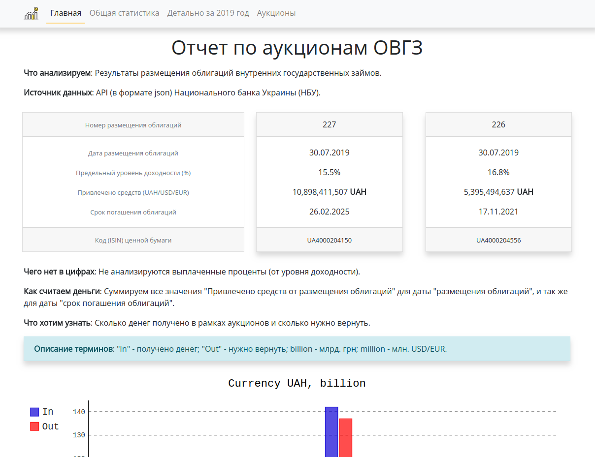
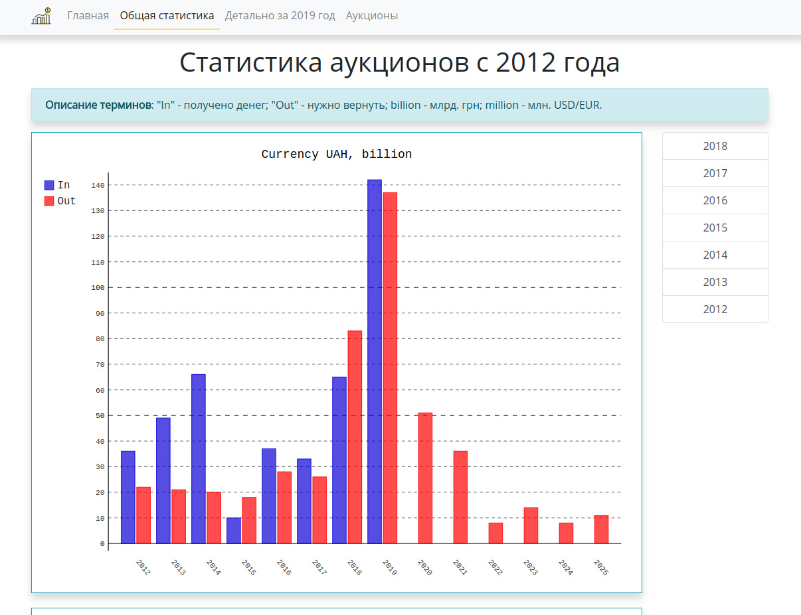
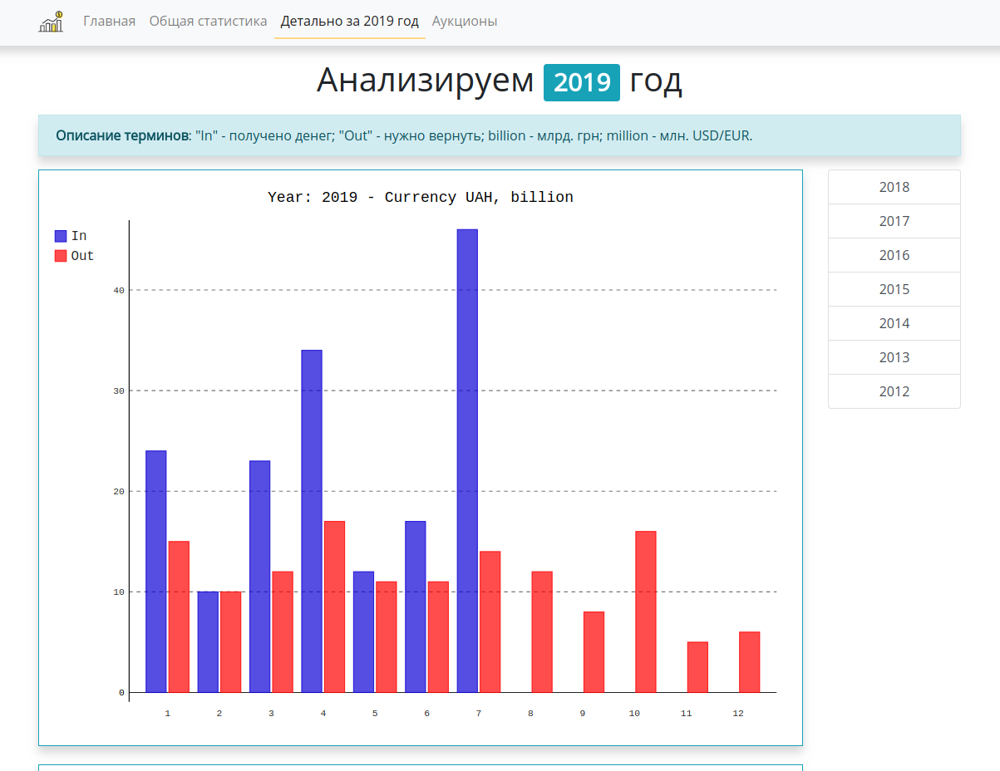
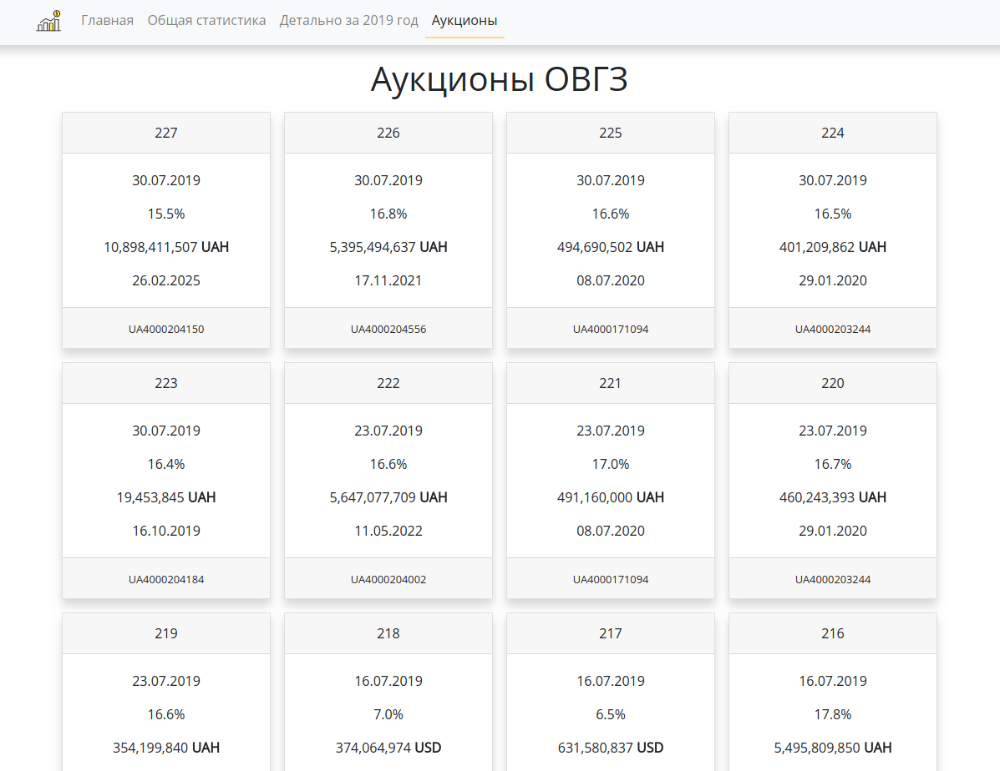

## Flask OVDP - Сайт по ОВГЗ (фреймворк Flask)

**Особенности реализации:**
- Вся логика в одном файле **app.py** (без мейнов, вьювов и блюпринтов).
- Без базы данных, данные по аукционам хранятся в файле **db_auctions.json**.
- Данные обновляются на сервере с помощью скрипта **load_data.py** (по крону).
- Обновления документируются в файл **update_data.log** для проверки.

**Внешний вид (Centos 7 + nginx + uwsgi):**

