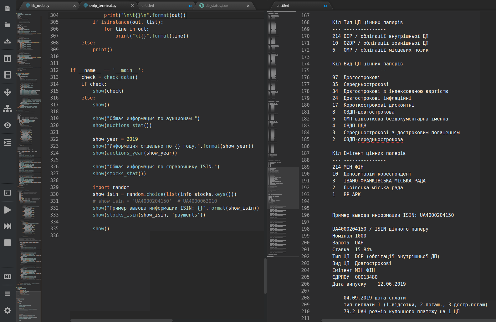
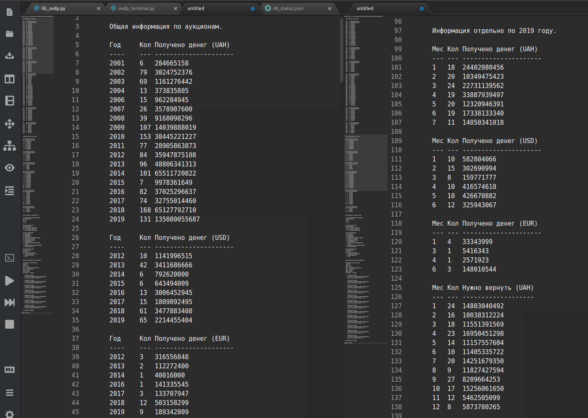
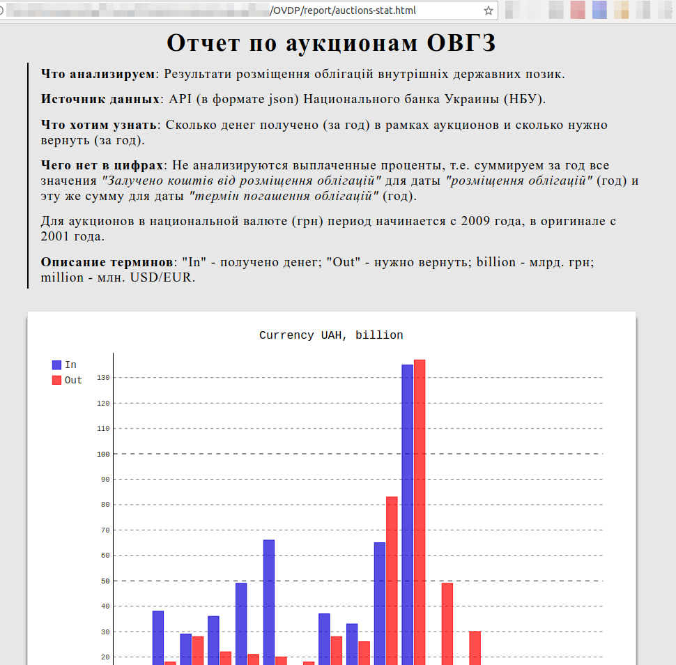

## OVDP - Данные по ОВГЗ

### ovdp_terminal.py
*без графического интерфейса*

**Особенности реализации:**
- Для обновления данных нужно удалить файлы *.json и запустить программу.
- **Важно!!!*** Для обновления нужен **модуль requests**, должен быть установлен отдельно.
- Если же работать с локальными данными (*.json) - requests не требуется.

### ovdp_report.py
*без графического интерфейса*

**Особенности реализации:**
- Для генерации отчетов (в формате svg) нужен **модуль pygal**, должен быть установлен отдельно.
- Файлы svg сохраняются **в папке report**, где доступны для просмотра в html документе.

